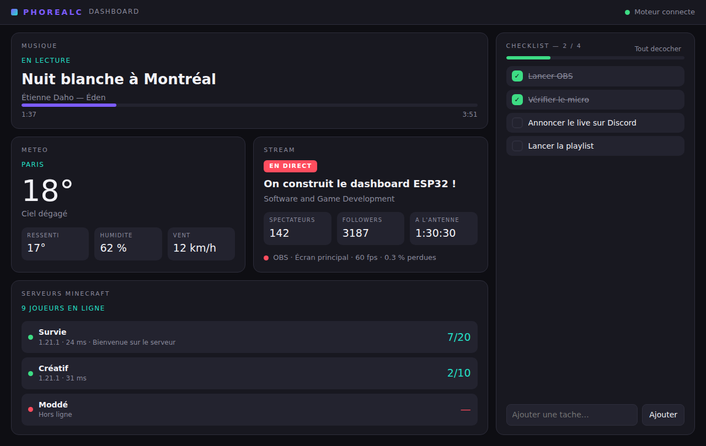

# Dashboard ESP32 — Phorealc

Tableau de bord physique connecte au PC : musique en cours, etat des serveurs
Minecraft, meteo, infos de stream et checklist tactile, sur un ecran 7 pouces —
et la meme chose dans une application PC.



## Structure

```
.
├── engine/           # moteur Python : sources de donnees + API HTTP  ← le cœur
├── esp32-firmware/   # firmware Arduino + LVGL pour l'ecran 7"
├── app-pc/           # coquille Tauri (fenetre PC, tray, autostart)
└── docs/             # contrat d'API et architecture
```

La racine du depot **est** le dossier `dashboard/` de la fiche projet ; les
trois briques sont donc directement ici plutot que sous un niveau supplementaire.

## Demarrage rapide

### 1. Le moteur (a faire en premier)

```bash
cd engine
python -m venv .venv && .venv/bin/pip install -e ".[dev]"
.venv/bin/python -m dashboard_engine
```

Au premier lancement, le moteur ecrit un `config.toml` commente et affiche son
chemin. En developpement (depuis `engine/`) c'est le dossier courant ; pour
l'application installee, le dossier utilisateur :

| Systeme | Emplacement |
| --- | --- |
| Windows | `%APPDATA%\Phorealc\Dashboard\config.toml` |
| macOS | `~/Library/Application Support/Phorealc/Dashboard/config.toml` |
| Linux | `~/.config/phorealc-dashboard/config.toml` |

`checklist.json` se range a cote.

Au demarrage, le moteur affiche l'URL a reporter dans le firmware :

```
[dashboard] URL a renseigner dans l'ESP32 : http://192.168.1.20:8787
```

Verification :

```bash
curl http://127.0.0.1:8787/api/health
```

Chaque module se signale disponible ou non, avec la raison. **Rien n'est
obligatoire** : sans cle meteo ni identifiants Twitch, le moteur demarre quand
meme et les cartes concernees s'affichent grisees.

### 2. Le firmware

```bash
cd esp32-firmware
cp include/app_config.example.h include/app_config.h   # SSID, mot de passe, IP du PC
pio run -t upload && pio device monitor
```

⚠ **Avant le premier flash**, verifiez le brochage dans `include/board_config.h`
contre le schema de votre carte : Waveshare a publie plusieurs revisions de
l'ESP32-S3-Touch-LCD-7 dont le bus RGB differe. C'est le seul fichier a adapter.

### 3. La coquille PC

```bash
cd app-pc
npm install
npm run dev        # se connecte au moteur deja lance
```

## Installer l'application (Windows)

Un installeur `.msi` et un `.exe` sont produits par GitHub Actions et attaches
a chaque release. **Rien a installer d'autre** : le moteur Python est empaquete
dans l'application, Python n'est pas requis sur la machine.

### Publier une version

```bash
git tag v0.1.0 && git push origin v0.1.0
```

Le workflow [`release.yml`](.github/workflows/release.yml) construit alors sur
`windows-latest` : PyInstaller empaquette le moteur, un test de fumee verifie
que le binaire demarre vraiment (c'est la que se voient les imports dynamiques
manquants), puis Tauri produit les installeurs et les attache a une release
en brouillon.

L'onglet **Actions → Release → Run workflow** lance la meme chaine sans tag :
les installeurs sortent alors en artefact de build, pratique pour tester.

### Mise a jour automatique

L'application verifie au demarrage s'il existe une version plus recente et
propose un bandeau « Installer et redemarrer ». Les mises a jour sont
**signees** : sans signature valide, l'application refuse de les installer.

Cette signature demande une paire de cles, a creer **une seule fois**. Je ne
peux pas la generer a votre place : la cle privee ne doit exister que chez vous
et dans les secrets du depot.

```bash
cd app-pc
npm install
npm run tauri signer generate -- -w ~/.tauri/dashboard.key
```

La commande affiche une **cle publique** et ecrit la **cle privee** dans le
fichier indique. Ensuite :

1. Collez la cle publique dans `app-pc/src-tauri/tauri.conf.json`,
   `plugins.updater.pubkey`.
2. Dans le depot GitHub, *Settings → Secrets and variables → Actions*, creez :
   - `TAURI_SIGNING_PRIVATE_KEY` — le **contenu** du fichier `~/.tauri/dashboard.key` ;
   - `TAURI_SIGNING_PRIVATE_KEY_PASSWORD` — le mot de passe choisi (secret vide si aucun).
3. Committez le `tauri.conf.json` modifie.

Tant que ces secrets sont absents, la release se construit quand meme : elle
produit un installeur normal, sans mise a jour automatique, et le workflow
l'annonce par un avertissement.

**Sauvegardez la cle privee.** Elle est perdue, toutes les futures mises a jour
le sont aussi : les applications deja installees refuseront un manifeste signe
par une autre cle, et vos utilisateurs devront reinstaller a la main.

Le mecanisme : chaque release publie un `latest.json` qui decrit la derniere
version et l'URL de son installeur. L'application interroge
`releases/latest/download/latest.json`, verifie la signature, telecharge, puis
laisse l'installeur prendre la main.

### Construire en local (sur Windows)

```powershell
pip install ./engine pyinstaller
cd engine; pyinstaller dashboard-engine.spec --noconfirm
mkdir ..\app-pc\src-tauri\binaries
copy dist\dashboard-engine.exe ..\app-pc\src-tauri\binaries\dashboard-engine-x86_64-pc-windows-msvc.exe
cd ..\app-pc; npm install; npm run build
```

Le suffixe est le triplet de la cible (`rustc -Vv`), c'est ainsi que Tauri
retrouve son sidecar. Le build doit tourner **sur Windows** : Tauri ne
compile pas d'installeur Windows depuis Linux.

## Depannage

### « Connexion au moteur… » qui ne finit jamais

L'interface tourne mais rien n'ecoute sur le port du moteur. Depuis la version
qui suit ce probleme, la barre de statut affiche la **cause** au bout de
quelques secondes plutot que de boucler en silence.

Verifiez d'abord si le moteur repond :

```powershell
curl http://127.0.0.1:8787/api/health
```

| Cause | Signe | Remede |
| --- | --- | --- |
| Vous lancez `npm run dev` sans sidecar | statut : « sidecar introuvable » | lancez `python -m dashboard_engine` a cote, ou construisez le sidecar (voir plus haut) |
| Le moteur s'arrete au demarrage | statut : « le moteur s'est arrete » | la sortie du moteur est recopiee dans celle de l'application ; lancez l'app depuis un terminal pour la lire |

### L'onglet Stream affiche « Streamlabs deconnecte »

L'API de Streamlabs Desktop n'est pas versionnee : ses noms de champs peuvent
changer d'une version a l'autre. Cette commande affiche ce que **votre**
installation renvoie vraiment :

```bash
python -m dashboard_engine.diagnose streamlabs   # ou: obs
```

Si les services repondent mais que l'ecran reste vide, comparez les champs
affiches a ceux que lit `build_state()` dans
`engine/dashboard_engine/sources/streamlabs_desktop.py`.
| Le port 8787 est deja pris | le moteur ecrit une erreur de bind | changez `[server].port` dans votre `config.toml` |
| `config.toml` invalide | le moteur s'arrete aussitot | corrigez-le, ou supprimez-le : il sera recree depuis le modele |

### Le moteur demarre mais toutes les cartes sont grisees

C'est normal sans cles API : chaque carte indique sa raison
(« cle API OpenWeatherMap manquante »...). Renseignez `config.toml`, puis
relancez. `GET /api/health` liste l'etat de chaque module.

## Reglages

**Le plus simple : le bouton « Reglages » dans l'application PC.** Cles API,
ville, serveurs Minecraft, logiciel de diffusion, jetons Streamlabs et Twitch —
tout se saisit dans des champs, et s'applique sans redemarrer.

Les cles deja enregistrees s'affichent masquees (`••••f43a`) : l'ecran montre
qu'elles sont en place sans les reveler, et les laisser telles quelles ne les
efface pas.

L'ecriture n'est possible que depuis le PC qui heberge le moteur. Un autre
appareil du reseau peut lire les reglages, secrets exclus, mais pas les modifier.

Le fichier reste editable a la main si vous preferez — son chemin est affiche
en haut de l'ecran de reglages.

## Configuration

Le `config.toml` cree au premier lancement (copie de
`engine/dashboard_engine/config.example.toml`) regroupe tout. Les secrets
peuvent rester hors du fichier et venir de l'environnement :

| Variable | Remplace |
| --- | --- |
| `DASHBOARD_WEATHER_API_KEY` | `[weather].api_key` |
| `DASHBOARD_TWITCH_CLIENT_ID` | `[stream].twitch_client_id` |
| `DASHBOARD_TWITCH_CLIENT_SECRET` | `[stream].twitch_client_secret` |
| `DASHBOARD_OBS_PASSWORD` | `[stream.obs].password` |
| `DASHBOARD_TOKEN` | `[server].token` |
| `DASHBOARD_PORT` | `[server].port` |

`config.toml` et `include/app_config.h` sont ignores par git : les identifiants
n'ont rien a faire dans l'historique.

### Ou trouver les cles

- **Meteo** — compte gratuit sur [OpenWeatherMap](https://home.openweathermap.org/api_keys)
  (comptez ~10 min d'activation).
- **Twitch** — application sur la [console developpeur](https://dev.twitch.tv/console/apps).
  Le flux `client_credentials` suffit : aucune connexion utilisateur.
- **Logiciel de diffusion** — `[stream.broadcaster].kind` vaut `streamlabs`,
  `obs` ou `none`. Les deux logiciels remontent les memes informations par des
  protocoles differents, d'ou le choix explicite.
  - *Streamlabs Desktop* : rien a configurer sous Windows, le tube nomme
    suffit. Sinon activez *Parametres > Remote Control* et copiez le jeton
    dans `[stream.broadcaster].token`.
  - *OBS Studio* : *Outils > Parametres du serveur WebSocket*, OBS 28 ou plus.
- **Alertes Streamlabs** (dons, follows, abonnements) — streamlabs.com >
  *Parametres > API Settings > API Tokens > Socket API Token*, a coller dans
  `[stream.streamlabs].socket_token`. A traiter comme un mot de passe.
- **Musique** — rien a configurer, mais **Windows uniquement** (API SMTC).
  Sous Linux/macOS le module se declare simplement indisponible.

## Tests

```bash
# moteur : 61 tests
engine/.venv/bin/python -m pytest engine/tests -q
engine/.venv/bin/python -m ruff check engine

# firmware : logique portable, sans carte ni toolchain ESP32
./esp32-firmware/test/run_native_tests.sh
```

## Documentation

- [`docs/api.md`](docs/api.md) — le contrat JSON partage par les deux ecrans.
- [`docs/architecture.md`](docs/architecture.md) — pourquoi c'est decoupe ainsi,
  et ce qui reste a faire.

## Etat d'avancement

| Etape | Etat |
| --- | --- |
| 1. Serveur Python (musique en JSON) | fait |
| 2. Firmware ESP32 affichant la donnee | fait |
| 3. Autres sources (serveurs, meteo, stream) | fait |
| 4. Interface LVGL soignee (onglets, cartes) | fait |
| 5. Coquille Tauri avec interface custom | fait |
| 6. Checklist interactive | fait |

Reste ouvert : pochettes d'album et previsions meteo sur l'ESP32, heure a
l'ecran (NTP), accents dans les polices LVGL. Voir la fin de
[`docs/architecture.md`](docs/architecture.md).
